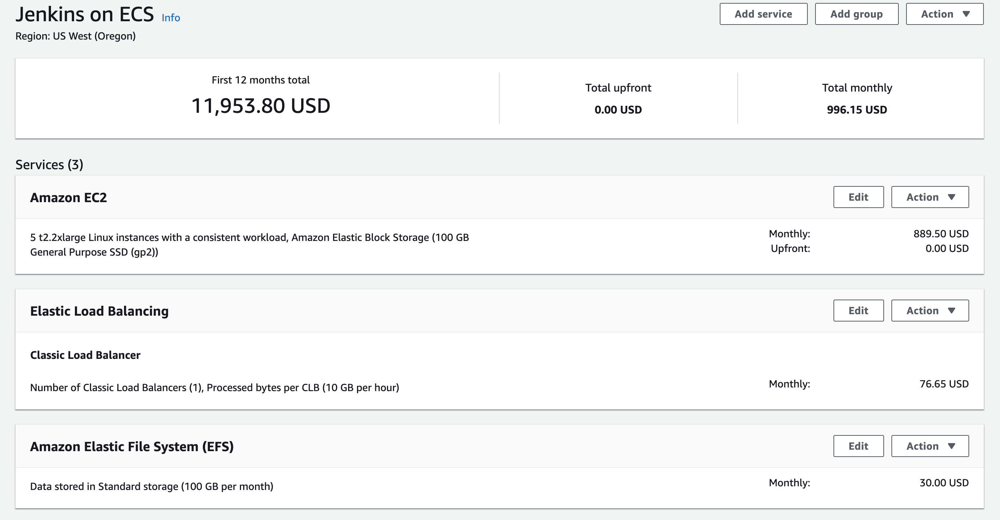
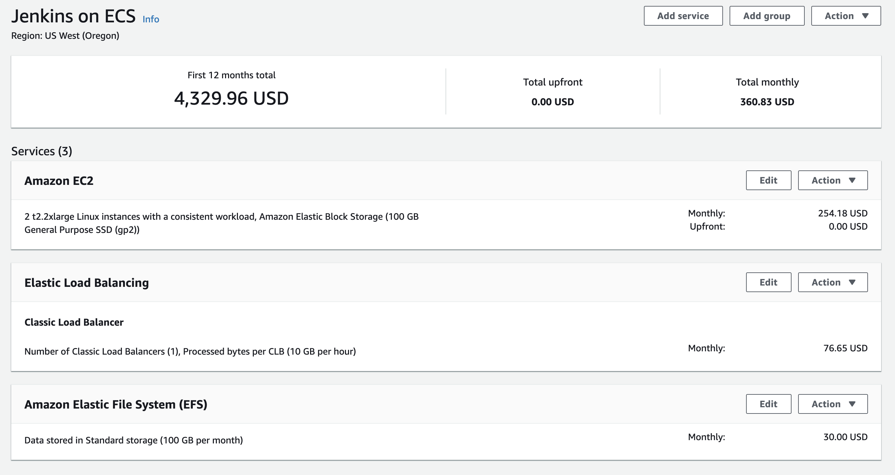

# Jenkins Infrastructure Overview

This Jenkins is 100% configured and managed as code.
Configuration is now mostly handled by the [Jenkins Configuration as Code (JCasC) plugin](https://jenkins.io/projects/jcasc/).
JCasC configs can be found as *.yaml files in [casc_config/](./jcasc/jenkins_build_context/casc_configs) directory.

We currently use init.groovy.d scripts to bootstrap the seed jobs. init.groovy.d scripts provide an escape hatch for features and plugins not yet supported by JCasC.

We utilize [Docker](https://www.docker.com/resources/what-container) and [AWS ECS](https://aws.amazon.com/ecs/)
to run both the master and the slaves.

## How it works

- We deploy the infra via [CloudFormation](https://aws.amazon.com/cloudformation/).

- The jenkins master docker image is built and stored in [AWS ECR](https://aws.amazon.com/ecr/) at `cmd/jenkins`

- The Jenkins master is run in ECS.
  - The master ECS TaskDefinition is specified within CloudFormation [ops.jenkins.ecs.yaml](./cf/parameters/ops.jenkins.ecs.yaml)

- All Jenkins slaves are run as tasks in ECS and are configured using JCasC [here](./jcasc/jenkins_build_context/casc_configs/jenkins.yaml).
  - More on slave configuration [here](##Jenkins-Slaves)

- We use [docker-compose.yml](./docker-compose.yml) for local development
  - There is also a [gradle wrapper](./jcasc/build.gradle) for the docker-compose commands
  - There is no longer a need for a bootstrap file. A combination of `.env` docker-compose env file and [aws-profile-switcher](../../utilities/aws/profile-switcher/README.md) are used to populate the correct env vars needed for local development.

- We currently manage secrets via [SSM](https://docs.aws.amazon.com/systems-manager/latest/userguide/systems-manager-paramstore.html) and inject them at runtime into the docker containers using [configuration-as-code-secret-ssm-plugin](https://github.com/jenkinsci/configuration-as-code-secret-ssm-plugin)

- All plugins are specified in [plugins.txt](./jcasc/jenkins_build_context/plugins.txt) and installed in the Dockerfile

- Jenkins gets bootstrapped with all the necessary configuration which comes from either JCasC or the startup scripts written in groovy.

- The seed job reaches out to all configured repos and seeds all jobs which have a `Jenkinsfile` at their root. It is scheduled to kick off shortly after boot and the automated [script security approval](https://jenkins.io/doc/book/managing/script-approval/).

  - [seed job config](./jcasc/seed/README.md)
    - Stores repository and job configuration. There is one config file per application or grouping that makes sense. All configs are written in yaml.

  - [seed boot and sync jobs](./jcasc/jenkins_build_context/casc_configs/jobs.yaml)
    - Triggers downstream scripts to handle job creation from the config
    - Initializes helpful utility jobs
    - Creates sync job. This syncs the casc configs to EFS for updates to Jenkins.

  - [seeding script](./jcasc/seed/seed.groovy)
    - Does the actual job generation from the seed configurations
    - Recursively goes through `/jcasc/seed/config/` and merges all configs into one groovy list
    - The list is processed and mapped to job dsl pipelines

  - [startup script](./jcasc/jenkins_build_context/init.groovy.d/startup.groovy)
    - Handles any security script approvals and initial build scheduling

  - [seed job](./jcasc/jenkins_build_context/casc_configs/jobs.yaml)
    - Triggers downstream scripts to handle job creation from the config

- Hosted [https://jenkins.cmd-ops.warnerbros.com/](https://jenkins.cmd-ops.warnerbros.com/)

## Architecture diagram


## Storage

- All instances get their own 100GB (configurable) EBS volume which is mounted via [`container-storage-setup`](https://github.com/projectatomic/container-storage-setup/) at instance launch from within the user data.

- `/var/lib/docker` is mounted on the above EBS.

- EBS volumes should mostly be thought of as completely ephemeral.
  - Task instances where the slaves are run are auto scaled via CloudWatch alarms and EBS volumes are deleted on termination.
  - The EBS volume attached to the jenkins master ecs service is also delete on termination, but is usually around for the life of the master. It may need to have a job to clean it periodically. Or a simple termination will suffice.

- All instances get access to efs. This is reserved for the master. This is where `/var/jenkins_home` is stored.
  - This allows us to take easy backups of the master.
  - This minimizes the complexity around finding and remounting ebs volumes. The master in this sense is now easily free to float among ECS instances if killed.
  - This is very nice for a quick dev cycle when making updates to the configuration or Dockerfile. Just kill the Jenkins master docker container `docker rm -f xxxxxxxxxx`

- #### PLEASE NOTE: For now we don't support [nitro based instances](https://docs.aws.amazon.com/AWSEC2/latest/UserGuide/nvme-ebs-volumes.html) as there are some extra intricacies involved with remounting volumes

Mounts on the host instance:

```bash
[root@ip-10-0-64-148 ~]# df -h
Filesystem                                 Size  Used Avail Use% Mounted on
devtmpfs                                    16G     0   16G   0% /dev
tmpfs                                       16G     0   16G   0% /dev/shm
tmpfs                                       16G  636K   16G   1% /run
tmpfs                                       16G     0   16G   0% /sys/fs/cgroup
/dev/xvda1                                  30G  1.1G   28G   4% /
/dev/mapper/docker--vg-docker--root--lv    100G  6.0G   94G   6% /var/lib/docker
overlay                                    100G  6.0G   94G   6% /var/lib/docker/overlay2/15fd8285974b139a75ef34f07c38613c7eda189902d9419e2b1660d02ddbc055/merged
fs-629b7dc9.efs.us-west-2.amazonaws.com:/  8.0E  1.2G  8.0E   1% /jenkins-home-efs
shm                                         64M     0   64M   0% /var/lib/docker/containers/9788d583378374ee43f944010b925016c38a37806b93e1183d63219800bbb10d/mounts/shm
tmpfs                                      3.2G     0  3.2G   0% /run/user/1000
overlay                                    100G  6.0G   94G   6% /var/lib/docker/overlay2/12a71b679c5f69f62d14cbdb805ca70f49cbb0d58684dba6404fc7ef2a9e3870/merged
overlay                                    100G  6.0G   94G   6% /var/lib/docker/overlay2/0ba6448af56d971adf59f5396138d21be6cc6874609c725f5b83803f1f4f72d0/merged
overlay                                    100G  6.0G   94G   6% /var/lib/docker/overlay2/8fc5b8b1f5b0ffe5b0c44848c0b84e8de06e3b86aabb6ecc0e1a4e9229cd6e02/merged
shm                                         64M     0   64M   0% /var/lib/docker/containers/885ae47e295e98eb7350110872c2a054ffeb0533aea4d9f70d92e16af1463245/mounts/shm
shm                                         64M     0   64M   0% /var/lib/docker/containers/91dc5d9ca3a747eda68814ebbedab5c187e03ed16706b43b680438d6315c8d1f/mounts/shm
shm                                         64M     0   64M   0% /var/lib/docker/containers/1d3bed4241a44c7fcd087184e9b34ca6736829c3a6ba8f6657d88d4f4e17542d/mounts/shm
tmpfs
```

Mounts within the jenkins master ecs service:

```bash
[ec2-user@ip-10-0-43-172 ~]$ docker exec -it d4f1ec81ed57 /bin/bash
root@d4f1ec81ed57:/# df -h
Filesystem                                 Size  Used Avail Use% Mounted on
overlay                                    100G  1.9G   99G   2% /
tmpfs                                       64M     0   64M   0% /dev
tmpfs                                       16G     0   16G   0% /sys/fs/cgroup
fs-629b7dc9.efs.us-west-2.amazonaws.com:/  8.0E     0  8.0E   0% /var/jenkins_home
/dev/mapper/docker--vg-docker--root--lv    100G  1.9G   99G   2% /etc/hosts
shm                                         64M     0   64M   0% /dev/shm
tmpfs                                       16G  464K   16G   1% /run/docker.sock
tmpfs                                       16G     0   16G   0% /proc/acpi
tmpfs                                       16G     0   16G   0% /proc/scsi
tmpfs                                       16G     0   16G   0% /sys/firmware
```

## Credentials

Credentials for jenkins are specified within [casc_config/credentials/](./jcasc/jenkins_build_context/casc_configs/credentials/)

Credentials for docker are managed in two places:

- The [JenkinsMasterTaskDefinition](./cf/jenkins-ecs-elb.yml). These are mainly for non secure environment variables that a required for bootstrapping e.g. `AWS_REGION`. We don't want to manage these in SSM.

- Secrets are managed via SSM. We inject them at runtime using a jenkins plugin that works with the casc plugin [configuration-as-code-secret-ssm-plugin](https://github.com/jenkinsci/configuration-as-code-secret-ssm-plugin)

You can reference credentials via the standard ways that Jenkins supports. Below is an example of using the Jenkins DSL Plugin with AWS credentials

```bash
# casc_configs/credentials.yaml
credentials:
  system:
    domainCredentials:
      - credentials:
          - aws:
              # CMDT_JENKINS_AWS_KEY_ID is stored in SSM and injected at runtime
              accessKey: ${CMDT_JENKINS_AWS_KEY_ID}
              description: aws access
              # Id that can be used in conjunction with amazonWebServicesCredentialsBinding
              id: cmdt_jenkins_aws_credentials
              scope: GLOBAL
              # CMDT_JENKINS_AWS_SECRET_KEY is stored in SSM and injected at runtime
              secretKey: ${CMDT_JENKINS_AWS_SECRET_KEY}

# In some Jenkinsfile or standalone groovy file.
job("example-job-with-aws-credentials") {
    description("Example job with aws credentials")
    # Run on master,maybe a boot or seed job
    label('master')
    # Predetermined slave label to run the job on ecs
    label('amz2-1cpu-2gb')
    triggers {
        cron "H/2 * * * *"
    }
    wrappers {
        credentialsBinding {
            amazonWebServicesCredentialsBinding {
                # Specify the saved aws credentials id.
                credentialsId("cmdt_jenkins_aws_credentials")
                # Sets the AWS environment variables into the job
                accessKeyVariable("AWS_ACCESS_KEY_ID")
                secretKeyVariable("AWS_SECRET_ACCESS_KEY")
            }
        }
    }
    steps {
        # Environment variables come from Jenkins
        shell("AWS_REGION=$AWS_REGION aws s3 ls")
    }
}
```

## JCasC

- For help configuring components, use the [reference](https://jenkins.cmd-ops.warnerbros.com/configuration-as-code/reference)

- It isn't rock solid, but you can export or view an example configuration [here](https://jenkins.cmd-ops.warnerbros.com/configuration-as-code/). Typically it is helpful to configure in the UI and then export to get the majority, if not all, of the yaml structure.

- You reload the configs manually [here](https://jenkins.cmd-ops.warnerbros.com/configuration-as-code/)

- Although this plugin is 1.*, it still has quite a few rough edges. When you can't integrate, please use groovy to configure your plugin. Watch for the latest [updates](https://github.com/jenkinsci/configuration-as-code-plugin/releases)

## Cron jobs

- We have two cron jobs that run
  - [scale in protection](./jcasc/jenkins_build_context/shell/protect-ec2-from-scale-in.sh)
  - [instance termination for full /var/lib/docker](./jcasc/jenkins_build_context/shell/terminate-ec2-at-max-memory.sh)

- These are set to run in `/var/spool/cron/root`

- The auto scaling group knows nothing about the tasks running. It is apt to kill the master or running jobs without much notice. These 2 crons alone run on every ec2 instance and properly manage scaling events.

- If load is always light and never triggers scaling events, then we must clear our `/var/lib/docker` after a while. It is easiest to ensure there are no job containers running and kill the instance instead of trying to clean out docker with prune etc.

- Scale in protection is enabled for all instances that have the minimum required containers running on them. This includes the master.

## Setup your environment for local development

- Install [Docker](https://docs.docker.com/docker-for-mac/install/)
- A Combination of `.env` docker-compose env file and [aws-profile-switcher](../../utilities/aws/profile-switcher/README.md) are used to populate the correct env vars needed for local development.

## Running Jenkins local

The build parameter `--build-arg RUNNING_ON_LOCALHOST=true` is required when wanting to run jenkins on localhost.

Please use straight docker-compose commands to run localhost and the gradle wrapper to deploy code `./gradlew login buildNoCache syncConfig tag push`.

The gradle wrapper and the docker-compose file hav `--build-arg RUNNING_ON_LOCALHOST=false` hard coded to false to ensure saml auth is enabled when shipped remote.

```bash
# Without gradle
docker-compose down -v && docker-compose build --build-arg RUNNING_ON_LOCALHOST=true && docker-compose up

# No cache and remove volumes
docker-compose down -v && docker-compose build --no-cache --build-arg RUNNING_ON_LOCALHOST=true && docker-compose up

# Can login to jenkins docker just launched
docker exec -it $(docker ps -ql) /bin/bash

# We have a few commands wrapped. These wrap docker-compose.
./gradlew build
./gradlew buildNoCache
./gradlew up
./gradlew down
./gradlew tag
./gradlew login
./gradlew push
./gradlew syncConfig

# Sync casc configs to s3 bucket 
./gradlew syncConfig

# Build fresh and push to ECR
./gradlew login buildNoCache syncConfig tag push

# Build and Run
./gradlew build up

# Run everything all at once
./gradlew login build syncConfig tag push up
```

## Deployment

Build and push to ECR

```bash
./gradlew login build syncConfig tag push
```

[Deploy CloudFormation](./cf/README.md)

The recommend approach is to use [simple-cfn](https://www.npmjs.com/package/simple-cfn).

```bash
simple-cfn deploy {stack-name} /path/ops.jenkins.ecs.yml --file=parameters/{env}.jenkins.yml
```

Deploy the Jenkins master ECS container after build to ecr

```bash
# Make ecs service-update to the cluster
./shell/update-ecs-jenkins-master.sh <env>
```

## ECR without gradle

```bash
# Get login credentials
$(aws ecr get-login --no-include-email --region us-west-2)

# Build the docker image
docker-compose build --no-cache

# Tag build with ECR convention.
docker tag cmd/jenkins:latest 147180035125.dkr.ecr.us-west-2.amazonaws.com/cmd/jenkins:latest

# Push to ECR
docker push 147180035125.dkr.ecr.us-west-2.amazonaws.com/cmd/jenkins:latest
```

## Jenkins Slaves in ECS

Configuration of the cloud agents can be found [here](./jcasc/jenkins_build_context/casc_configs/jenkins.yaml)

- All slaves will be predefined ahead of time. We are shooting for 5-10 generalized slave options.
  - 4 CPU 8 GB - heavy ( jvm, docker, packer )
  - 2 CPU 4 GB - heavy ( jvm, docker, packer )
  - 1 CPU 2 GB - light-medium ( jvm, bash, automation, notification, docker, packer )
  - .5 CPU 1 GB - light-medium ( jvm, bash, automation, notification, docker, packer )
  - .25 CPU .5 GB - light ( jvm, bash, automation, notification )

- Slaves can specify any publicly available docker image to run on which supports JNLP.
  - [cloudbees/jnlp-slave-with-java-build-tools](https://hub.docker.com/r/cloudbees/jnlp-slave-with-java-build-tools/)
  - [pwbsladek/jenkins-amazonlinux2-jnlp-slave](https://hub.docker.com/r/pwbsladek/jenkins-amazonlinux2-jnlp-slave)

- To use a specifc slave, simply reference it's label in your job.

  - label: "amz2-{number-cpu}cpu-{memory-amount}gb"
    - amz2-4cpu-8gb

  - Please be sure to memory and cpu are adequate to run your job. The majority of builds will only require the lowest settings. Please performance test your builds.

```bash
clouds:
  - ecs:
      cluster: "arn:aws:ecs:${AWS_REGION}:${AWS_ACCOUNT_ID}:cluster/wb-cmd-${AWS_JENKINS_ENVIRONMENT}-jenkins-ecs-cluster"
      credentialsId: "cmdt_jenkins_aws_credentials"
      jenkinsUrl: ${JENKINS_HOST_URL}
      # It is easiest to keep the same name for template,name,and label
      name: amz2-4cpu-8gb
      regionName: ${AWS_REGION}
      retentionTimeout: 60
      tunnel: "${JENKINS_TUNNEL_URL}:${JENKINS_SLAVE_PORT}"
      templates:
        - assignPublicIp: false
          cpu: 4096
          # Public image to pull and build on
          # Must support JNLP
          image: pwbsladek/jenkins-amazonlinux2-jnlp-slave
          label: amz2-4cpu-8gb
          launchType: EC2
          memory: 8192
          memoryReservation: 4096
          networkMode: default
          privileged: false
          remoteFSRoot: /home/jenkins
          templateName: amz2-4cpu-8gb
```

## Jenkins development workflows

### Updating credentials

- Please see the [credentials section](##Credentials)

- You will need to build a new docker image.
  - Ensure you have configured `~/.aws/credentials`
  - `./gradlew login buildNoCache tag push`

- Kill the jenkins master ecs service to pull the new image
  - This is a safe operation when no jobs are running
  - All jenkins files are stored on EFS

```bash
./shell/find-ecs-jenkins-master.sh ops
Container instance: arn:aws:ecs:us-west-2:147180035125:container-instance/68abf8a4-f55b-4e7b-af91-161b52d21b04
Jenkins master instance id: i-0f7edb133a9e1a793
Private ip: 10.0.46.158
Protected from scale in: true
Health status: HEALTHY

# Start a session to connect to the ec2 hosting the jenkins master
aws ssm start-session --target i-0f7edb133a9e1a793

# Find master container id
docker ps 

# Delete the jenkins master
docker rm -f dd3d0260e870
```

- Give it about 2-3 min to pull back up the service

### Rerunning the seed job

- You can rerun the seed job at anytime to sync the jobs with their remote configuration at [seed job](./jcasc/seed/README.md).

- If the build fails, it is probably because you need to [approve](##How-it-works) the seed script again.

- If you make changes to the any of the configs located at `jcasc/seed/config/*`, which specifies which jobs to configure, you will need to commit your changes to `develop` and rerun the job after the you merge your code.

- The parent jobs are configured to reach out to Jenkinsfiles hosted in the Github repos.

### Making casc config changes

- Rebuild and S3 Sync is required to update casc_configs
  
  - `./gradlew login buildNoCache syncConfig tag push`

  - deploy changes: `../shell/update-ecs-jenkins-master.sh ops`

  - run `casc_config_sync` job

- The configs are stored [here](./jcasc/jenkins_build_context/casc_configs)

- A [manual reload](https://jenkins.cmd-ops.warnerbros.com/configuration-as-code/) of the configs is required once we are ready to update Jenkins with the changes
  
- Please test your changes local first and then shoot a PR over

## Build and load testing

- A group of jobs pre-configured for testing out load, build tools, slave connectivity, and performance are [here](./jcasc/jenkins_build_context/dsl/buildAndLoadTesting.groovy)

- These jobs are configured upon the initial startup of Jenkins.

## Recovery

- If you kill the container running the master
  - About 2-3 min for the ecs service to place it back
  - The master will be repopulated by what was left on the EFS

- If you kill the ec2 instance
  - About 3-5 min for ecs to generate new instance
  - About 2-3 min for ecs to place back the service and tasks

- If a scale event kills an instance and its associated EBS volume, you may loose the cache for a job and subsequent jobs may take a hit on time.

## Performance

- TODO Fill out rough est of performance benchmarks from load test jobs
  
## Cost

#### On demand


- Shutdown during off hours could reduce cost of both by 1/3 to 1/2

#### 1 year reservation




#### 3 year reservation




## Naming conventions

#### AWS

- ECR = {namespace}/{repo}
  - namespace = cmd
  - repo = jenkins

- SSM = /com/warnerbros/cmd/{ENVIRONMENT}/{service}/{KEY}
  - `/com/warnerbros/cmd/ops/jenkins/ADMIN_PASSWORD`
  - Make sure the {KEY} is in all caps for correct export as an environment variable

- ECS = wb-cmd-{env}-{service}
  - `wb-cmd-ops-ecs-jenkins`
  - `amz2-05cpu-1gb`
  - image labels use {os-abv}-{cpu}-{memory}

- CloudFormation = wb-cmd-{env}-{service}
  - `wb-cmd-ops-jenkins`
  - Leave out `""` double quotes in yaml when not needed

#### Repository

- Gradle commands are camel case
  - `./gradlew login buildNoCache`

- Directories use `_` as a delimiter

- Files use `-` as a delimiter

#### JCasC

- Environment variables use all caps and `_` as a delimiter

- Leave out `""` double quotes in yaml when not needed

## TODO

- Lock down role permissions to exact resources

- Carry over and testing of existing infra from other jenkins

- AWS Backup for snap of EFS for jenkins backups? Or just manual dump of EFS home into S3 via job.

- Placement groups: <https://github.com/jenkinsci/amazon-ecs-plugin/pull/81>

- POC removal of container-setup, think ecs optimized images now mount lib docker by default

- POC ALB-NLB implementation of jenkins on ecs.
  - Again had to revert back to ELB over ALB because jnlp is over TCP, ALB doesn't support
